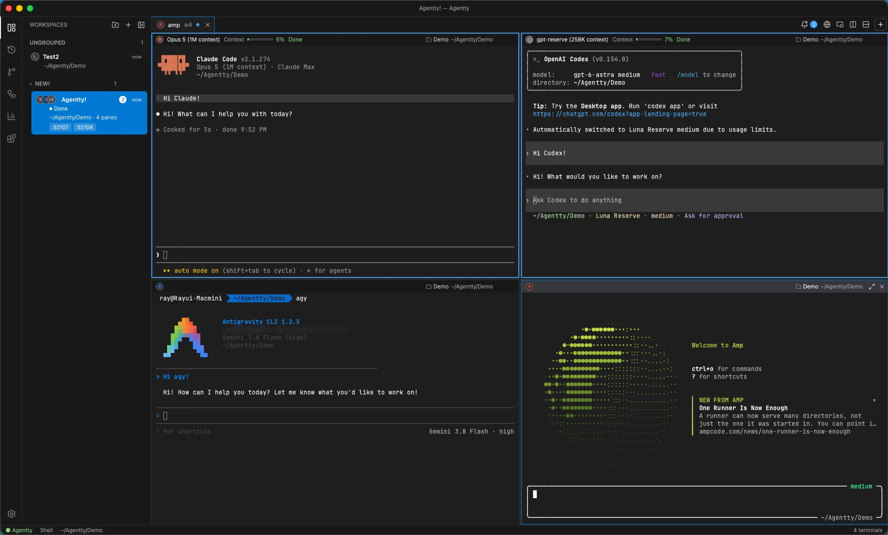

# Agentty

  

  <b>AI NATIVE · PARALLEL AGENTS · NATIVE RUST</b> 
  <i>The real terminal for the AI Native era.</i>

  <a href="https://agentty.run">Website</a> ·
  <a href="https://www.agentty.run/docs">Guide</a> ·
  <a href="https://github.com/empty-user77/agentty-releases/releases/latest">Download</a> ·
  <a href="https://x.com/raylee_world">@raylee_world</a>

  <a href="#english">English</a> ·
  <a href="#한국어">한국어</a> ·
  <a href="#日本語">日本語</a> ·
  <a href="#中文-简体">中文</a>

  
  
  
  

  

---

## English

### The real terminal for the AI Native era

Run every AI agent in one window, see what each one is doing, and let them share context.

Agentty is a native terminal for AI coding agents — **Claude Code**, **Codex**, Gemini CLI, Amp, OpenCode and a dozen
more. It knows which agent is working, which finished and which is waiting for you, and gives each one what the work
needs: the project's files, its Git history, its containers and its databases.

> 17MB · no Electron · 13+ agent CLIs · one window for all of them

### Why Agentty

- **Knows your agents** — working, finished, or waiting for you: per pane, in the sidebar, in the menu bar, and in a
  desktop notification that opens the right pane. Away from the computer? It can message Slack, Discord or Telegram.
- **Runs them side by side** — workspaces, tabs and split panes, restored after a restart. A second agent in the same
  project gets its own git worktree, so two agents never edit the same file.
- **Shares context between sessions** — drag a line from one session to another, keep it live in both directions, or
  move a conversation from Claude Code to Codex and back.
- **More than a terminal** — files panel with an editor, Git, Docker, databases, an in-app browser, usage and cost
  monitoring, extensions and MCP servers, plugins.
- **Careful with your data** — an agent reads your database in a read-only transaction, and every write waits for you
  to approve the exact statement. Secrets live in the Keychain; conversations never leave your computer.

**[Read the guide →](https://www.agentty.run/docs)** for what every part of the app does.

### Download

Get the latest build from [Releases](https://github.com/empty-user77/agentty-releases/releases/latest).

| Platform | File | Notes |
|---|---|---|
| macOS 13+ (Apple Silicon) | `Agentty-X.Y.Z-…-arm64.dmg` | Signed and notarized. Drag `Agentty.app` into `/Applications` |
| Windows 10 1809+ (x64) | `Agentty-X.Y.Z-windows-x64-setup.exe` | Per user, no administrator rights |
| Debian 12+ / Ubuntu 22.04+ | `Agentty-X.Y.Z-linux-amd64.deb` | `sudo apt install ./Agentty-*.deb` |
| RHEL 9+ / Fedora | `Agentty-X.Y.Z-linux-x86_64.rpm` | `sudo dnf install ./Agentty-*.rpm` |

> The Windows and Linux packages ship from the next release; the current one carries the macOS build.

Agentty checks for new versions at launch and every hour: macOS and Windows install and relaunch for you, Linux
points at the new packages. `claude` and/or `codex` on your `PATH` gives you agent tabs — Settings → System installs
what is missing.

### Your conversations stay on your computer

Session lists, usage numbers and handoffs are built from the transcript files already on your machine. Prompts,
output and repository data are never uploaded, and agent status events reach only your own user account. Apart from
the APIs and MCP servers you add yourself, the app goes online only to check for updates and service status.

Anonymous usage statistics (which features were used, the app and system version, a random install ID) can be turned
off at first run, in Settings → General, or with `DO_NOT_TRACK=1`.

### Support

Bugs and feedback: [Issues](https://github.com/empty-user77/agentty-releases/issues).

---

## 한국어

### AI Native를 위한 진짜 터미널

모든 AI 에이전트를 한 창에서 돌리고, 각자 뭘 하는지 보고, 서로 맥락을 주고받게 합니다.

Agentty는 AI 코딩 에이전트를 위한 네이티브 터미널입니다. **Claude Code**, **Codex**, Gemini CLI, Amp, OpenCode를
비롯해 십여 종을 지원합니다. 어떤 에이전트가 작업 중이고, 끝났고, 답을 기다리는지 알고 있으며, 각 에이전트에게
작업에 필요한 것 — 프로젝트의 파일, Git 이력, 컨테이너, 데이터베이스 — 을 함께 쥐여 줍니다.

> 17MB · Electron 없음 · 13종 이상의 에이전트 CLI · 전부 한 창에서

### 왜 Agentty인가

- **에이전트 상태를 압니다** — 작업 중 · 완료 · 응답 대기를 페인마다, 사이드바에, 메뉴 막대에, 그리고 클릭하면
  해당 페인이 열리는 데스크톱 알림으로 보여 줍니다. 자리를 비웠다면 Slack · Discord · Telegram으로도 보냅니다.
- **나란히 돌립니다** — 워크스페이스 · 탭 · 분할창이 재시작 후에도 복원됩니다. 같은 프로젝트의 두 번째 에이전트는
  별도 git 워크트리에서 시작하므로 두 에이전트가 같은 파일을 건드리지 않습니다.
- **세션끼리 맥락을 나눕니다** — 세션 사이에 선을 이어 컨텍스트를 넘기고, 양방향으로 계속 동기화하고, Claude Code ↔
  Codex로 대화를 옮깁니다.
- **터미널 이상입니다** — 편집기가 붙은 파일 패널, Git, Docker, 데이터베이스, 인앱 브라우저, 사용량·비용 모니터링,
  확장과 MCP 서버, 플러그인.
- **데이터를 조심히 다룹니다** — 에이전트의 DB 조회는 읽기 전용 트랜잭션에서 실행되고, 쓰기는 실행할 문장을 그대로
  보여 주는 승인을 거쳐야 합니다. 비밀값은 Keychain에, 대화 기록은 내 컴퓨터에만 있습니다.

**[가이드 보기 →](https://www.agentty.run/docs)** — 각 화면과 기능 설명이 있습니다.

### 다운로드

최신 빌드는 [Releases](https://github.com/empty-user77/agentty-releases/releases/latest)에 있습니다.

| 플랫폼 | 파일 | 비고 |
|---|---|---|
| macOS 13+ (Apple Silicon) | `Agentty-X.Y.Z-…-arm64.dmg` | 서명·공증 완료. `Agentty.app`을 `/Applications`로 |
| Windows 10 1809+ (x64) | `Agentty-X.Y.Z-windows-x64-setup.exe` | 사용자 단위 설치, 관리자 권한 불필요 |
| Debian 12+ / Ubuntu 22.04+ | `Agentty-X.Y.Z-linux-amd64.deb` | `sudo apt install ./Agentty-*.deb` |
| RHEL 9+ / Fedora | `Agentty-X.Y.Z-linux-x86_64.rpm` | `sudo dnf install ./Agentty-*.rpm` |

> Windows·Linux 패키지는 다음 릴리즈부터 제공됩니다. 현재 릴리즈에는 macOS 빌드가 들어 있습니다.

Agentty는 실행할 때와 매시간 새 버전을 확인합니다. macOS와 Windows는 설치 후 재시작까지 해 주고, Linux는 새 패키지를
안내합니다. `PATH`에 `claude` 또는 `codex`가 있으면 에이전트 탭이 열리고, 없는 도구는 설정 → 환경 점검에서 설치할 수
있습니다.

### 대화 기록은 내 PC에만 있습니다

세션 목록, 사용량, 컨텍스트 전달은 이미 내 컴퓨터에 있는 대화 파일로 만듭니다. 프롬프트·출력·저장소 데이터는 전송되지
않고, 에이전트 상태 이벤트는 내 계정만 접근할 수 있습니다. 직접 추가한 API와 MCP 서버를 빼면, 앱이 외부와 통신하는 건
업데이트 확인과 서비스 상태 확인뿐입니다.

익명 사용 정보(어떤 기능을 썼는지, 앱과 시스템 버전, 무작위 설치 ID)는 첫 실행에서, 설정 → 일반에서, 또는
`DO_NOT_TRACK=1`로 끌 수 있습니다.

### 문의

버그와 피드백은 [Issues](https://github.com/empty-user77/agentty-releases/issues)로 보내 주세요.

---

## 日本語

### AI Nativeのための本物のターミナル

すべての AI エージェントをひとつのウィンドウで動かし、それぞれの状態を見て、文脈を共有させます。

Agentty は AI コーディングエージェントのためのネイティブターミナルです。**Claude Code**、**Codex**、Gemini CLI、
Amp、OpenCode など十数種に対応します。どのエージェントが作業中で、終わっていて、返事を待っているかを把握し、
それぞれに作業で必要なもの — プロジェクトのファイル、Git の履歴、コンテナ、データベース — を渡します。

> 17MB · Electron なし · 13 種類以上のエージェント CLI · すべてをひとつのウィンドウで

### Agentty を選ぶ理由

- **エージェントの状態が分かります** — 作業中・完了・入力待ちを、ペインごとに、サイドバーに、メニューバーに、
  そしてクリックでそのペインが開く通知で示します。離席中なら Slack・Discord・Telegram にも届きます。
- **並べて動かせます** — ワークスペース・タブ・分割ペインは再起動後も復元されます。同じプロジェクトの 2 つ目の
  エージェントは専用の git ワークツリーで始まるので、同じファイルを同時に編集することはありません。
- **セッション間で文脈を共有します** — セッション同士を線でつないで引き継ぎ、双方向で同期し、Claude Code と
  Codex の間で会話を移せます。
- **ターミナル以上のもの** — エディタ付きファイルパネル、Git、Docker、データベース、アプリ内ブラウザ、使用量と
  コストのモニタリング、拡張と MCP サーバー、プラグイン。
- **データの扱いは慎重に** — エージェントの参照は読み取り専用トランザクションで実行され、書き込みは実行する文を
  そのまま示す承認を通ります。秘密情報は Keychain に、会話履歴は自分の PC だけに残ります。

**[ガイドを読む →](https://www.agentty.run/docs)**

### ダウンロード

最新ビルドは [Releases](https://github.com/empty-user77/agentty-releases/releases/latest) にあります。

| プラットフォーム | ファイル | 備考 |
|---|---|---|
| macOS 13+（Apple Silicon） | `Agentty-X.Y.Z-…-arm64.dmg` | 署名・公証済み。`Agentty.app` を `/Applications` へ |
| Windows 10 1809+（x64） | `Agentty-X.Y.Z-windows-x64-setup.exe` | ユーザー単位、管理者権限不要 |
| Debian 12+ / Ubuntu 22.04+ | `Agentty-X.Y.Z-linux-amd64.deb` | `sudo apt install ./Agentty-*.deb` |
| RHEL 9+ / Fedora | `Agentty-X.Y.Z-linux-x86_64.rpm` | `sudo dnf install ./Agentty-*.rpm` |

> Windows と Linux のパッケージは次のリリースから提供されます。現在のリリースには macOS ビルドが入っています。

Agentty は起動時と 1 時間ごとに新しいバージョンを確認します。macOS と Windows はインストールと再起動まで行い、
Linux は新しいパッケージを案内します。`PATH` に `claude` や `codex` があればエージェントタブが使え、足りない
ツールは 設定 → システムチェック から導入できます。

### 会話の記録はあなたの PC だけに

セッション一覧、使用量、コンテキストの受け渡しは、すでに手元にある会話ファイルから作られます。プロンプト・出力・
リポジトリのデータが送信されることはなく、エージェントの状態イベントはあなたのアカウントだけがアクセスできます。
自分で追加した API と MCP サーバーを除けば、アプリが外部と通信するのは更新とサービス状態の確認だけです。

匿名の利用統計（使った機能、アプリとシステムのバージョン、ランダムなインストール ID）は、初回起動時、
設定 → 一般、または `DO_NOT_TRACK=1` で無効にできます。

### サポート

不具合やご意見は [Issues](https://github.com/empty-user77/agentty-releases/issues) へ。

---

## 中文 (简体)

### 面向 AI 原生时代的真正终端

在一个窗口里运行所有 AI 智能体，看清每一个在做什么，并让它们共享上下文。

Agentty 是为 AI 编码智能体打造的原生终端，支持 **Claude Code**、**Codex**、Gemini CLI、Amp、OpenCode 等十多种。
它知道哪个智能体正在工作、哪个已完成、哪个在等你回答，并把工作真正需要的东西交给它们：项目的文件、Git 历史、
容器和数据库。

> 17MB · 无 Electron · 13+ 种智能体 CLI · 全部集中在一个窗口

### 为什么选择 Agentty

- **了解你的智能体** — 工作中、已完成、等待你回答：在每个分屏、侧边栏、菜单栏，以及点击即可打开对应分屏的桌面
  通知中呈现。不在电脑前时，还能发送到 Slack、Discord 或 Telegram。
- **并排运行** — 工作区、标签页和分屏在重启后依旧还原。同一项目中的第二个智能体会获得独立的 git worktree，
  两个智能体不会改到同一个文件。
- **会话之间共享上下文** — 在两个会话之间连线传递上下文，保持双向同步，或在 Claude Code 与 Codex 之间迁移对话。
- **不只是终端** — 带编辑器的文件面板、Git、Docker、数据库、应用内浏览器、用量与成本监控、扩展与 MCP 服务器、插件。
- **谨慎对待你的数据** — 智能体的查询在只读事务中执行，任何写入都要经过显示原始语句的确认。密钥存放在 Keychain，
  对话记录只留在你的电脑上。

**[阅读指南 →](https://www.agentty.run/docs)**

### 下载

最新版本见 [Releases](https://github.com/empty-user77/agentty-releases/releases/latest)。

| 平台 | 文件 | 说明 |
|---|---|---|
| macOS 13+（Apple Silicon） | `Agentty-X.Y.Z-…-arm64.dmg` | 已签名并公证，将 `Agentty.app` 拖入 `/Applications` |
| Windows 10 1809+（x64） | `Agentty-X.Y.Z-windows-x64-setup.exe` | 按用户安装，无需管理员权限 |
| Debian 12+ / Ubuntu 22.04+ | `Agentty-X.Y.Z-linux-amd64.deb` | `sudo apt install ./Agentty-*.deb` |
| RHEL 9+ / Fedora | `Agentty-X.Y.Z-linux-x86_64.rpm` | `sudo dnf install ./Agentty-*.rpm` |

> Windows 与 Linux 安装包将从下一个版本开始提供，当前版本包含 macOS 构建。

Agentty 会在启动时和每小时检查新版本：macOS 与 Windows 自动安装并重启，Linux 指向新的软件包。`PATH` 中有
`claude` 或 `codex` 即可使用智能体标签页，缺少的工具可在 设置 → 环境检查 中安装。

### 对话记录只留在你的电脑上

会话列表、用量统计和上下文传递，都基于你电脑上已有的记录文件生成。提示词、输出和仓库数据不会上传，智能体状态
事件只有你的账户可以访问。除了你自行添加的 API 与 MCP 服务器，应用只会为检查更新和服务状态而联网。

匿名使用统计（使用了哪些功能、应用与系统版本、随机安装 ID）可在首次启动时、设置 → 通用，或用 `DO_NOT_TRACK=1`
关闭。

### 支持

问题反馈请前往 [Issues](https://github.com/empty-user77/agentty-releases/issues)。
